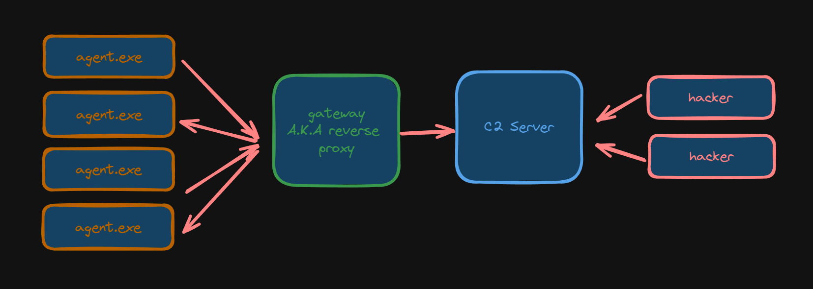

# T-SEC-901-LYO_13

## StormWave 
StormWave is our malware. StormWave run like an agent and allow attacker to exec commands. 



### Attack 

1) The attacker use the [RemoteMouse Exploit](https://github.com/p0dalirius/RemoteMouse-3.008-Exploit) to spawn a shell. 
An evil powershell script will be downloaded and started. 

2) Powershell script 
The script will first download a malicious exe file to disable Windows Defender.
The script also download a malicious DLL file and save it in the System32 folder. This DLL will be automatically loaded at startup time with NT Authority System right. <dllname> allow use to disable the AV and turn off firewall continiously. 

The powershell script also install the agent A.K.A Stormware. 

3) StormWave 
StormWave detect sandbox and stop his execution if a sandbox is detected. StormWave try to be persitant everytime. 

### Features
- sandbox detection 
- screenshot
- record audio 
- upload file 
- send file 
- ping 
- ddos
- get uuid 
- get private ip 
- get public ip 
- get wifi password 
- password stealer 
- persistence
- zip file 
- update config 
- windows registry


### How to run
Node js v19 is required. 

#### Frontend
```bash
cd Stormwave/c2-server/web
npm install 
npm run dev 
```

#### Backend
You can change the opened port.
```bash
cd Stormwave/c2-server/backend
npm install 
npm run dev 4000
```

#### Malware
Change the gateway ip in `configuration.go`.
You need golang and make.
```bash
cd Stormwave/malware/stormwave
make compile # make compile-debug if you want a debug version
```
The output bin is under /bin


# Used tools
- [PowerShell_IPv4NetworkScanner](https://github.com/BornToBeRoot/PowerShell_IPv4NetworkScanner)


# Sources : 
- [Coldfire](https://github.com/redcode-labs/Coldfire)
- [GoKeylogger](https://github.com/Faeris95/GoKeylogger/)